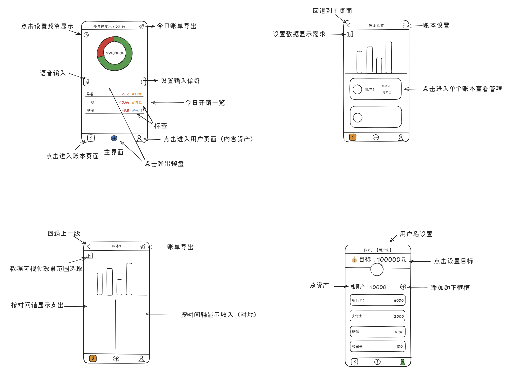

# 记账本软件

### 介绍

一个账本软件。

目前设想的功能有：  
1. 快速记账（对话框型）
   1. 语音输入记账
   2. 文本型自动识别标签/分类、日期
   3. *拓展功能，微信对话框
2. 预算设置
3. 账本分类
4. 导出功能
5. 用户设置
6. 数据可视化

### UI
#### 页面设计思路
1. 主页是对话框和自动弹出的键盘（初启动时自动弹出键盘
2. 键盘可以折叠，主页显示预算和支出可视化（键盘折叠为加号按钮
3. 对话框左侧是语音输入按钮，右侧是回车
4. 主页详细说明：
   1. 上半部分：预算和支出对比（环形图）
   2. 下半部分：今日账单明细（点击查看详情
5. 第二页：账本、账单、预算设置
6. 第三页：用户设置
   1. 账号登录
   2. 设置备份

#### 页面效果图
version 1.0
  
#### 使用说明

### 工程目录

### 具体实现

### 约束与限制